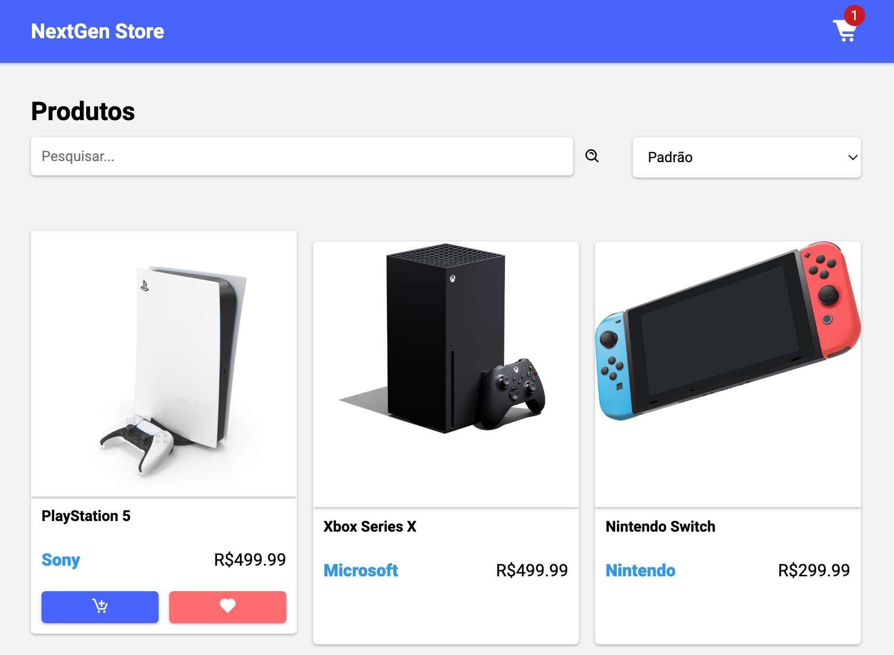
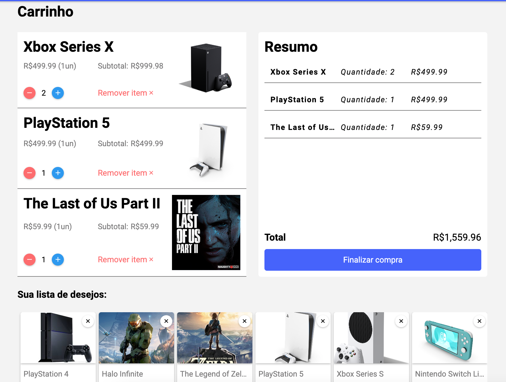

<h1 align="center" style="font-weight: bold;">Teste front-end NextGen 💻</h1>

    <a href="#tech">Tecnologias</a> • 
    <a href="#pages">Páginas</a> • 
    <a href="#comp">Components</a> • 
    <a href="#layout">Layout</a> • 

    <b>Um site de venda de Consoles e games, com listagem no home e página de carrinho</b>

<h2 id="tech">💻 Technologies</h2>

- Angular 17
- TypeScript
- HTML5
- CSS3

Angular foi o escolhido por ser um FrameWork mais robusto e que pode entregar até para algo simples, um código mais organizado e correto. Com um código mais legível e utilizando muito bem a tipagem do TypeScript, caso seja preciso a manutenção e a possibilidade de escalar deste código é provida pelo Angular.

<h2 id="pages">📟 Páginas</h2>

- Home
- Cart

<h2 id="comp">🧩 Components</h2>

Resolvi destacar os web components porque foram cruciais nessa aplicação.

- Header: 

como uma parte "always on top" do software, fiz um component separado para saber e controlar as funcionalidades dele.

- Home Card: 

O card principal da aplicação, por ele é possivel adicionar itens ao carrinho ou wishlist, com o tamanho variando dependendo do viewport, se tornando responsivo.

- Driver Card: 

Um desafio! Primeira vez utilizando animations do Angular, um component que recebe dados dinamicamente e reativamente baseado na ação do usuário, ele indica caminhos para ir após uma determinada ação.

- Cart Card: 

O cart do carrinho de compras, simples mas efetivo, não deixando o usuário pedir um valor abaixo de 1 de um item nem acima do valor total em estoque. Utilizando signals de forma que toda ação ali seja reativa.

- Wish list: 

Uma wishlist com cards próprios e comportament único, armazena os desejos que o user adiciona pelo Home card e o da à opção de adicionar aquele desejo ao carrinho, para encaminhar à compra.

- Confirmation: 

Um modal de confirmação que informa o usuário a situação atual da compra.

- Loading: 

Um loading geral, quando tem uma grande alteração na DOM, ele dinamicamente pelo signal do serviçe e pelo metodo que chama o loading, cobre a view inteiramente e depois retorna.

<h2 id="layout"> 🎨 Layout</h2>

- Home

    

- Cart driver

    

- Cart

    

